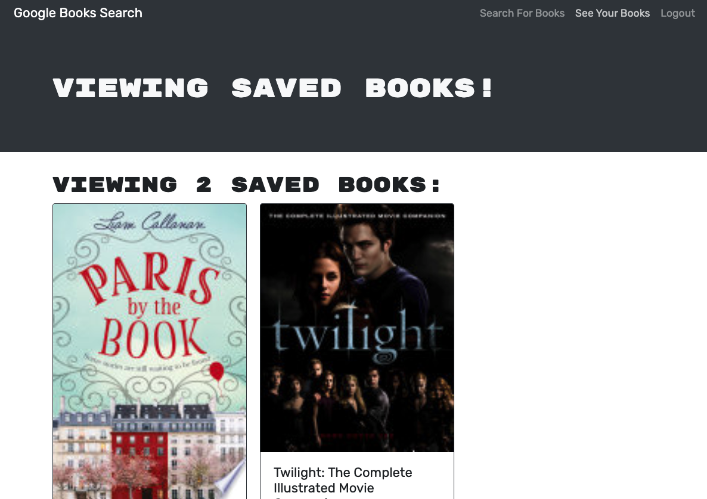

# Book Search Engine

> A Google Books API search engine made with React, a GraphQL API built with Apollo Server and MongoDB - MERN stack.
> Live demo [_here_](https://www.example.com).

## Table of Contents

- [Technologies Used](#technologies-used)
- [Features](#features)
- [Screenshots](#screenshots)
- [Setup](#setup)
- [Usage](#usage)
- [Contact](#contact)
- [License](#license)

## Technologies Used

- React
- GraphQL
- Apollo Server
- MongoDB, Mongoose
- JWT

## Features

- Search Google Books API for inspiration.
- Save and delete books in your profile.

## Screenshots




## Setup

Run the following in your console to set up the project and install dependencies.

```shell
$ git clone https://github.com/lilyso/book-search-engine.git
$ npm install
```

## Usage

Run the following command to start development sever:

```shell
$ npm run develop
```

## Contact

Created by [@lilyso](https://github.com/lilyso) - feel free to contact me!

## License

This project is open source and available under the [... License]().
